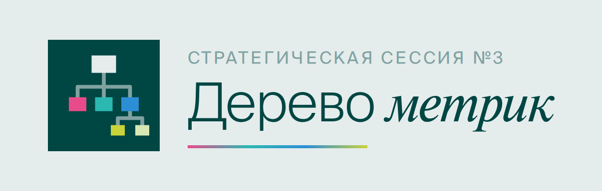

<p align="center"></p>

# Стратсессия №3 · День 2

Веб-приложение второго дня стратегической сессии Coral Club: «От метрик к типам функций». Одна страница `index.html` без сборки, работает с GitHub Pages и базой Supabase из дня 1.

## Что внутри

| Путь | Назначение |
|---|---|
| `index.html` | Всё приложение: 28 слайдов, шрифты Suisse Intl и Newton, таймеры, инструмент Елены, конструктор дерева |
| `assets/` | Логотип и иконки: `favicon.svg`, `favicon-32.png`, `apple-touch-icon.png`, `og-image.png` (превью ссылки), `logo-mark.svg/-512.png`, `logo-lockup-light/dark.png` |
| `tools/elena-sales-tree.html` | Оригинал инструмента Елены Клейменовой (отдельная страница, без синхронизации) |
| `tools/elena-model-spec.json` | Формулы и структура модели Елены |
| `supabase/migrations/…sql` | SQL для базы: таблица деревьев, история, функция сохранения |
| `.nojekyll` | Отключает обработку Jekyll на GitHub Pages |

## Публикация на GitHub Pages

1. Создайте репозиторий, например `3-StratSessionCC-day2`, или папку `day2/` во вчерашнем `3-StratSessionCC`.
2. Загрузите содержимое пакета в корень репозитория (или папки): **Add file → Upload files**, перетащите всё, включая `assets/` и `.nojekyll`.
3. **Settings → Pages → Build and deployment:** Source — *Deploy from a branch*, Branch — `main`, папка — `/ (root)`. Сохраните.
4. Через 1–2 минуты сайт откроется по адресу `https://vittttttttto-777.github.io/<имя-репозитория>/`.
5. Для красивого превью в мессенджерах замените в `index.html` строку `og:image` на полный адрес: `https://vittttttttto-777.github.io/<имя-репозитория>/assets/og-image.png`.

Обновление: загрузите новый `index.html` поверх старого — GitHub Pages пересоберётся сам.

## Ссылки для сессии

| Кто | Ссылка | Что происходит |
|---|---|---|
| Ведущий | `…/` → «Вход для редактора» → PIN | Может сохранять общее дерево CCI, управлять инструментом Елены и транслировать слайды |
| Проектор | `…/#screen` | Экран следует за ведущим: слайд и язык. Ведущий включает «Транслировать на проектор» |
| Группы | `…/`, слайд 27 | Конструктор дерева, выбор своего трека в строке «Где хранить дерево» |

PIN тот же, что в дне 1 (хранится хешем в `strat3_admin`).

## Как работает база

Проект Supabase: `awwhrlenhqoreagzfymn` (ключ `sb_publishable_…` уже вшит в страницу, он публичный по назначению).

| Объект | Назначение |
|---|---|
| `strat3_trees` | Одна строка на слот: `HealthOS`, `GrowthModel`, `PrimeGrowth`, `CoralEVO`, `ITModel`, `CCI`, `elena`. Читают все, изменения приходят в реальном времени |
| `strat3_tree_save(slot, tree, pin)` | Единственный способ записи. Треки — без PIN; `CCI` и `elena` — только с PIN ведущего; размер дерева до 200 КБ |
| `strat3_tree_history` | Снимок дерева не чаще раза в минуту на слот. С клиента недоступна |
| `strat3_save(… 'presenter-d2' …)` | Трансляция слайдов дня 2 на проектор (ключ отделён от дня 1) |

Восстановить дерево трека из истории (SQL Editor в Supabase):

```sql
-- посмотреть версии
select id, saved_at from strat3_tree_history where slot = 'HealthOS' order by saved_at desc;
-- вернуть выбранную версию
update strat3_trees t set tree = h.tree, updated_at = now()
from strat3_tree_history h where h.id = <id> and t.slot = h.slot;
```

Очистить деревья после сессии: `delete from strat3_trees;` (история останется).

## Проверка перед сессией

- [ ] Сайт открывается по ссылке GitHub Pages, логотип виден во вкладке.
- [ ] На двух устройствах выбран один трек на слайде 27 — метрика, добавленная на одном, появляется на другом.
- [ ] Ведущий вошёл по PIN: в инструменте Елены подпись «Вы ведущий…», смена сценария видна на втором устройстве.
- [ ] Проектор по `#screen` переключается вслед за ведущим.
- [ ] QR-код на слайде 19 открывает форму «Тип функции».
- [ ] Переключатель RU/EN переводит слайды, инструмент Елены и конструктор.

## Ограничения

- Слоты треков пишутся без пароля: кто выбрал чужой трек, может его перезаписать (есть история для отката).
- В превью claude.ai база недоступна (политика безопасности превью) — там конструктор работает локально.
- Режим «На весь экран» не работает внутри превью claude.ai, на GitHub Pages работает.
